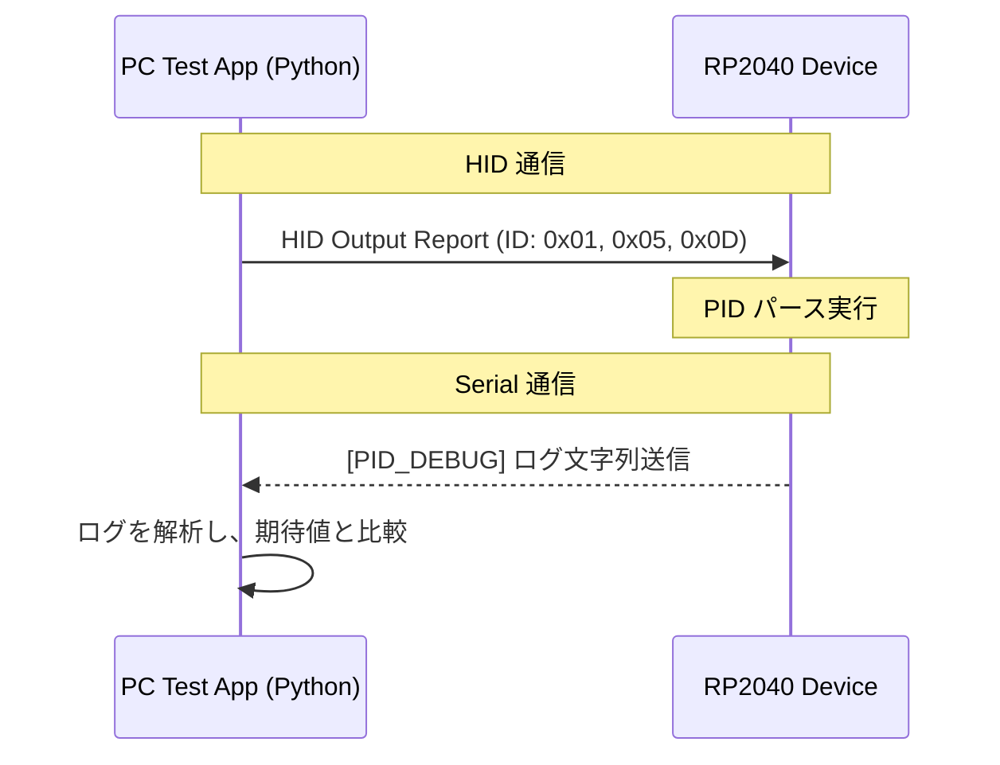

# PIDパース機能チェックツール (DebugApp) 仕様書

## 1. 概要
本ドキュメントは、RP2040デバイスに実装されたPID（Physical Interface Device）プロトコルのパース機能が正しく動作するかを検証するための、PC側テストアプリおよび通信仕様を定義するものです。

## 2. 通信構成
テストアプリは以下の2つのフローを使用して検証を行います。

1.  **送信 (PC → Device)**: `USB HID Output Report` を使用して、検証用のPIDデータ（Report ID: 0x01, 0x05, 0x0D）を送信します。
2.  **受信 (Device → PC)**: `USB CDC (Serial)` を使用して、デバイス側でパースされた結果の要約をテキスト形式で受け取り、送信値と比較します。

## 3. USB I/O 仕様

### 3.1. PCからの送信データ (HID Output Report)
各レポートの構造は埋め込み側の `hidwffb.h` に準拠します。

| Report ID | 名称 | 主要フィールド | サイズ (bytes) |
| :--- | :--- | :--- | :--- |
| **0x01** | Set Effect | Effect Type(1), Gain(2), etc. | 14 |
| **0x05** | Set Constant Force | Magnitude(2) | 4 |
| **0x0D** | Device Gain | Device Gain(1) | 3 |

> [!IMPORTANT]
> Report ID 0x01 では、`Effect Type = 0x26` (Constant Force) の場合のみ、パース処理が行われます。

### 3.2. デバイスからの返却データ (Serial Debug Log)
デバイスはレポートを受信・パースした後、以下の形式でシリアル出力を行います。

*   **ID 0x01 受信時**:
    `[PID_DEBUG] ID:0x01, Type:Constant, Mag:<gain_value>, Gain:<device_gain_value>`
*   **ID 0x05 受信時**:
    `[PID_DEBUG] ID:0x05, Mag:<magnitude_value>`
*   **ID 0x0D 受信時**:
    `[PID_DEBUG] ID:0x0D, G:<gain_value>`

## 4. テストケース案

### 4.1. 正常系テスト
- **Report 0x01**: Effect Typeを0x26に設定し、Gainを 0, 16384, 32767 と変化させて、正しく認識されるか。
- **Report 0x05**: Magnitudeを -32767, 0, 32767 と変化させて、符号を含めて正しく認識されるか。
- **Report 0x0D**: Device Gainを 0, 128, 255 と変化させて、正しく認識されるか。

### 4.2. 異常系・境界値テスト
- **未対応ID**: 定義されていないパケットを送った際、デバイスがフリーズせず無視されるか。
- **範囲外の値**: 8bitフィールドに 256 以上の値を入れようとした場合や、不正な Effect Type (0x26以外) を送った際の挙動。
- **データ長不足**: Report ID に続くデータが構造体サイズに満たない場合に、パース処理を安全にスキップするか。

## 5. PCアプリ実装要件 (Python)
- **GUIライブラリ**: `customtkinter` または `tkinter` (要相談、モダンなUIにはCustomTkinterを推奨)。
- **HIDライブラリ**: `hidapi` (`pyusb` よりも Windows での動作が安定するため)。
- **シリアルライブラリ**: `pyserial`。
- **機能**:
    - COMポートおよびHIDデバイスの自動/手動選択。
    - 各Report IDに対応した入力フィールド（スライダー/数値入力）。
    - 受信ログ表示エリアおよび自動OK/NG判定表示。
