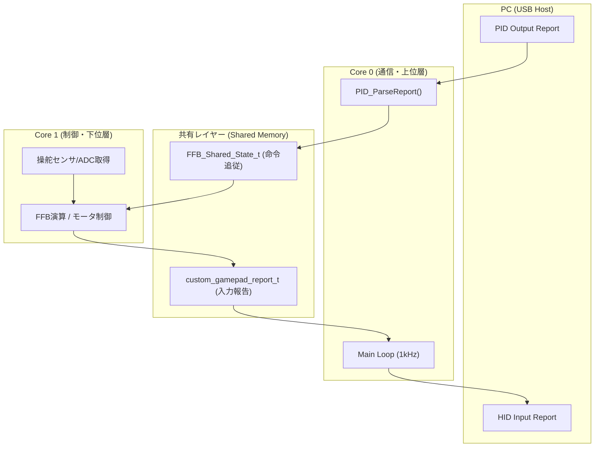

# hidwffb モジュール 取扱説明書

`hidwffb` (HID with Force Feedback) は、Raspberry Pi RP2040 で Force Feedback (FFB) 対応のゲームコントローラを構築するためのモジュールです。

## 1. モジュール概要

*   **16ビット高解像度軸**: Z軸 (Steer), Rx軸 (Accel), Ry軸 (Brake) の3軸。
*   **16個のデジタルボタン**: 標準的なゲームパッドとして認識されます。
*   **FFB 対応 (Output Report)**: PC からの FFB 制御データ（64バイト）を受信可能です。

## 2. 依存関係

本モジュールは以下のライブラリおよび設定を必要とします。

### ライブラリ
*   **Adafruit TinyUSB Library (@ ^3.1.0)**

### platformio.ini 設定
USBスタックとして TinyUSB を使用するため、以下の設定が必要です。

```ini
lib_deps = 
    adafruit/Adafruit TinyUSB Library @ ^3.1.0

build_flags = 
    -DUSE_TINYUSB
    -DARDUINO_USB_MODE=0
```

## 3. API リファレンス

すべての関数は `hidwffb.h` をインクルードして使用します。

### 初期化 (setup() 内で実行)

*   `void hidwffb_begin(uint8_t poll_interval_ms = 1)`
    *   HID デバイスを初期化し、USB スタックを開始します。
    *   `poll_interval_ms`: USB ポーリング周期（デフォルト 1ms = 1000Hz）。
*   `void hidwffb_wait_for_mount(void)`
    *   USB ホストにマウントされるまでブロッキングして待機します。

### 送受信 (loop() 内で実行)

*   `bool hidwffb_send_report(custom_gamepad_report_t *report)`
    *   コントローラの状態を PC へ送信します。
*   `bool hidwffb_ready(void)`
    *   デバイスが送信可能な状態（マウント済み・サスペンド解除済み）か確認します。
*   `bool hidwffb_get_ffb_data(uint8_t *buffer)`
    *   PC から届いた最新の FFB データ（64バイト）を取得します。
    *   `bool hidwffb_get_pid_debug_info(pid_debug_info_t *info)`
    *   パースされたPIDプロトコルの要約データを取得します。
    *   デバッグ出力用として `main.cpp` 等で利用されます。

    *   生データを受け取って内部構造体を更新する純粋なパース関数です。
    *   特定のUSBスタックに依存せず、`stdint.h` の型のみを使用しています。

### ユーティリティ (util.h)

精密な制御周期を維持するための非ブロッキングタイマー関数を提供します。

*   `bool checkInterval_m(uint32_t &last_ms, uint32_t interval_ms)`
    *   ミリ秒単位の周期判定。
*   `bool checkInterval_u(uint32_t &last_us, uint32_t interval_us)`
    *   マイクロ秒単位の周期判定。

**使用例:**
```cpp
static uint32_t last_ms = 0;
if (checkInterval_m(last_ms, 1)) { // 1000Hz周期
    // 定期実行タスク
}
```

## 4. PID プロトコルのサポート

本モジュールは、USB PID (Physical Interface Device) プロトコルの一部をパースする機能を備えています。

### サポート対象
*   **Constant Force (Report ID: 0x01)**: `effectType` が `0x26` の場合に Constant Force として処理。
*   **Constant Force Magnitude (Report ID: 0x05)**: 効果の強度設定。
*   **Device Gain (Report ID: 0x0D)**: デバイス全体のゲイン設定。
*   **Effect Operation (Report ID: 0x0A)**: エフェクトの開始・停止（Start / Solo / Stop）制御。

## 5. テストツール (Tools)
 
 本プロジェクトには、動作検証用の Python アプリケーションが `tools/python/` に用意されています。
 
 ### PID Tester (`pid_tester.pyw`)
 *   **用途**: PCからFBBレポートを送信し、デバイス側のパース結果をシリアルログで確認します。
 *   **主要機能**: Constant Force (ID:0x01, 0x05), Device Gain (ID:0x0D), Effect Operation (ID:0x0A) の送信テスト。
 
 ### HID Tester (`hid_tester.pyw`)
 *   **用途**: デバイスから送信されるHID入力レポート（ステアリング、アクセル等）のリアルタイム表示。
 *   **機能**: シリアル経由でのループバックテスト機能も備えています。
 
 ## 6. デバッグログとPCアプリケーションとの連携

PC側（Python等）での自動照合を容易にするため、シリアルポートから特定のプリフィックスを持つログを出力できます。

### ログの有効化
`main.cpp` 内の以下のマクロ定義を有効にしてください。
```cpp
#define PID_DEBUG_ENABLE
```

### ログフォーマット仕様
PCアプリ側で `readline()` して正規表現などでパース可能な形式です。

1.  **Constant Force 受信時**:
    *   `[PID_DEBUG] ID:0x01, Type:Constant, Mag:16384, Gain:255`
    *   `Mag`: 強度（-32767 to 32767）
    *   `Gain`: 現在設定されているデバイスゲイン（0 to 255）

2.  **Device Gain 受信時**:
    *   `[PID_DEBUG] ID:0x0D, G:255`
    *   `G`: デバイスゲイン値（0 to 255）

3.  **Effect Operation 受信時**:
    *   `[PID_DEBUG] ID:0x0A, Index:1, Op:Start`
    *   `Index`: エフェクトブロックインデックス（1 to 40）
    *   `Op`: 操作内容（Start, Solo, Stop）

## 7. HID 入力デバッグ機能 (シリアルコマンド)

`HID_INPUT_DEBUG_ENABLE` が有効な場合、シリアルモニタからダミーの入力を流し込むことができます。

### コマンド形式
`HID:S<Steer>,A<Accel>,B<Brake>,BTN<Buttons>`

*   `S`: ステアリング (-32767 to 32767)
*   `A`: アクセル (-32767 to 32767)
*   `B`: ブレーキ (-32767 to 32767)
*   `BTN`: ボタンビットマスク (0 to 65535)

**例:** `HID:S10000,A-32767,B-32767,BTN1`
このコマンドを受信すると、5秒間物理入力を無視し、指定されたダミーデータをHIDレポートとして送信します。

## 8. マルチコア構成時の注意点

RP2040 でマルチコア（Core0/Core1）を利用する場合、以下の点に注意してください。

### USB タスクの固定 (Core0)
Adafruit TinyUSB の制約上、**USB 通信および `hidwffb` の API（特に `begin` や `send_report`）は Core0 で呼び出すこと**を推奨します。

### 排他制御の必要性
もし FFB データの演算を Core1 で行い、入出力を Core0 で行う場合は、共有バッファへのアクセスに排他制御（Mutex や `critical_section`）を導入してください。

> [!WARNING]
> 本モジュールは、Core 間の同期用に関数を提供していますが、呼び出し側の順序管理が重要です。

### 8.1. 排他制御の仕組み
共有メモリへのアクセスには `mutex_t` を使用しています。呼び出し側は以下の関数を使用して同期を行います。
- `ffb_core0_update_shared()`: Core0 でパースした FFB 命令を共有メモリへ。
- `ffb_core1_update_shared()`: Core1 の物理入力を共有メモリへ、FFB命令をローカルへ。
- `ffb_core0_get_input_report()`: Core0 が共有メモリから最新の入力レポートを取得。

### 8.2. ループバックテスト (CALLBACK_TEST_ENABLE)
共有メモリを通じた導通を検証するためのテスト用フレームワークです。
- **挙動**: PID レポート (0x01, 0x05, 0x0D等) を受信すると 5 秒間フラグが立ち、Magnitude 等の値をそのまま HID 入力軸に投影します。
- **連動する軸**: Steer <- Magnitude (0x05), Accel <- Gain (0x01), Brake <- Device Gain (0x0D)。
- **デバッグログ**: Core1 視点での導通を `[CORE1_DEBUG]` としてシリアル出力します。

## 9. 実装例

```cpp
#include "hidwffb.h"

// デバッグ有効化
#define PID_DEBUG_ENABLE

void setup() {
  hidwffb_begin(1);
  hidwffb_wait_for_mount();
}

void loop() {
  // HID送信処理...

  // PIDデバッグ情報の取得と表示
#ifdef PID_DEBUG_ENABLE
  pid_debug_info_t pid_info;
  if (hidwffb_get_pid_debug_info(&pid_info)) {
    if (pid_info.lastReportId == 0x01) {
      Serial.printf("[PID_DEBUG] ID:0x01, Type:Constant, Mag:%d, Gain:%d\n", 
                    pid_info.magnitude, pid_info.deviceGain);
    }
  }
#endif
}
```

## 10. システムアーキテクチャと移植ガイド

`hidwffb` モジュールは、RP2040 のマルチコア性能を最大限に引き出し、移植性を確保するために「通信・パース層 (Core0)」と「制御・演算層 (Core1)」を分離した設計を推奨しています。

### 10.1 データフロー概略

本プロジェクトの `main.cpp` は、実環境への移植を容易にするための以下のテンプレート構成をとっています。



### 10.2 主要構造体の役割

#### 1. `custom_gamepad_report_t`
*   **用途**: デバイスから PC へ送信するコントローラ状態の定義。
*   **移植時の観点**: Core1 でセンサやボタンの物理値を読み取り、正規化した値をこの構造体に格納します。Core0 はこの内容を定期的に `hidwffb_send_report()` で PC へ送ります。

#### 2. `FFB_Shared_State_t`
*   **用途**: Core0 でパースされた FFB 命令を Core1 に伝達する共有状態。
*   **移植時の観点**: エフェクトの種類（Magnitude, Gain）やアクティブ状態 (`active`) を保持します。Core1 の演算ループはこの構造体を参照してモータの出力を決定します。

#### 3. `pid_debug_info_t`
*   **用途**: `PID_ParseReport()` による解析結果を一時的に集約した構造体。
*   **移植時の観点**: シリアルデバッグだけでなく、上位アプリケーション層で「現在どのエフェクトが更新されたか」を検知するためのフラグ (`updated`) を含みます。

### 10.3 移植時の設計ルール

1.  **USB 処理の Core0 固定**: USB スタック（TinyUSB）の制約上、通信関連の API は必ず Core0 で実行してください。
2.  **Core1 でのリアルタイム制御**: サーボ制御やエフェクト計算など、ジッタを嫌う処理は Core1 で独立して行い、共有メモリとの同期は `checkInterval` を用いた適切なタイミングで行ってください。
3.  **排他制御の導入**: 共有メモリへの読み書きが衝突しないよう、実際の移植先では `mutex_t`（`pico/mutex.h`）によるロックを適用してください。

> [!TIP]
> 現在の `main.cpp` は、これらの構成を網羅した「リファレンス実装（テンプレート）」です。独自の制御ロジックを実装する場合は、`loop1()` 内の演算ロジックを書き換えるだけで対応可能です。
